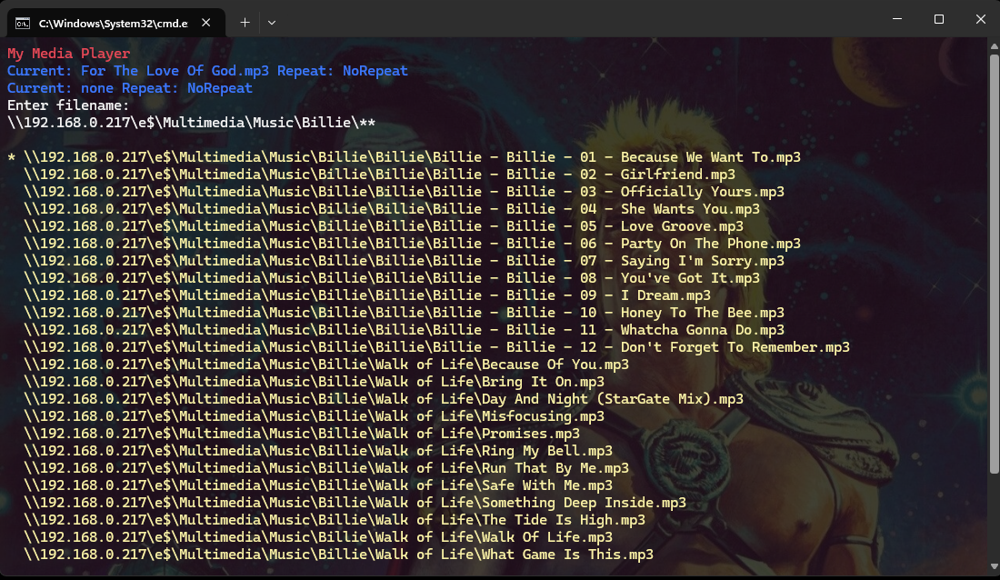

## Introduction

My Media Player (mmp) is command line audio player, powered by naudio.

## Download

Compiled downloads are not available.

## Compiling

To clone and run this application, you'll need [Git](https://git-scm.com) and [.NET](https://dotnet.microsoft.com/) installed on your computer. From your command line:

```
# Clone this repository
$ git clone https://github.com/btigi/mmp

# Go into the repository
$ cd src

# Build  the app
$ dotnet build
```

## Usage

```mmp```

`up arrow` - volume up

`down arrow` - volume down

`1` - previous track

`2` - next track

`a` - add new track (maintain playlist), supports tab completion

`n` - add new track (clear playlist), supports tab completion

`space` - pause / unpause

`r` - repeat mode (repeat none -> repeat track -> repeat playlist)

`s` - stop playback

`p` - begin playback

`v` - show playlist

Keys can be rebound by editing appsettings.json

When adding tracks (via `a` or `n`) if the path ends in * then all tracks in the directory are added. If the path ends in ** then all tracks in the directory and all sub-directories are added.

#

Example screenshot



## Configuration

Configuration values are stored in appsettings.json

Keys can be rebound to values from the [ConsoleKey enum ](https://learn.microsoft.com/en-us/dotnet/api/system.consolekey?view=net-8.0)
  `Play` - begin  playback

  `Stop` - stop playback

  `NewSong` - add new track (clear playlist)

  `AddPlaylist` - add new track (maintain playlist)

  `ShowPlayList` - show playlist

  `VolumeUp` - volume up

  `VolumeDown` - volume down

  `TrackNext` - next track

  `TrackPrev` - previous track

  `PlayPause` - pause / unpause

  `Repeat` - repeat mode

Colours can be customized. Colours are .NET colour types mapped to ConsoleColour types. Invalid colours are mapped as black.
```
  "TitleForegroundColour": "Red",
  "TitleBackgroundColour": "Black",
  "CurrentTextForegroundColour": "White",
  "CurrentTextBackgroundColour": "Black",
  "CurrentSongForegroundColour": "Blue",
  "CurrentSongBackgroundColour": "Black",
  "VolumeTextForegroundColour": "White",
  "VolumeTextBackgroundColour": "Black",
  "VolumeForegroundColour": "Blue",
  "VolumeBackgroundColour": "Black",
  "TextForegroundColour": "White",
  "TextBackgroundColour": "Black",
  "PlaylistForegroundColour": "Yellow",
  "PlaylistBackgroundColour": "Black",
```

The default starting volume can be adjusted:

`"DefaultVolume": "0.5"`

Multiple instances can be prevented:

`"AllowMultipleInstances": true`

Note: There is no interaction with any existing instance of the application, the only effect is that the additional instance exist automatically.

## Licencing

mmp is licenced under CC BY-NC-ND 4.0 https://creativecommons.org/licenses/by-nc-nd/4.0/ Full licence details are available in licence.md